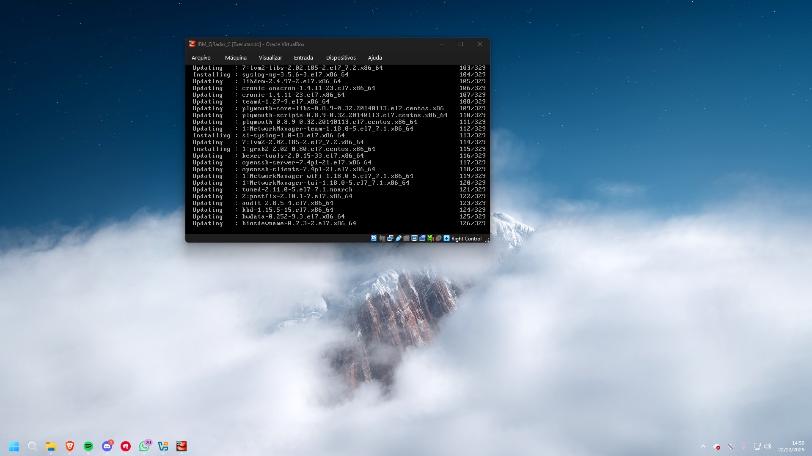
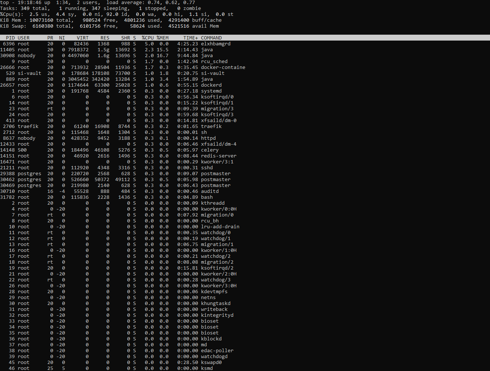

# QRadar SIEM Lab: Deployment & Advanced Troubleshooting

## 🎯 Visão Geral
Este projeto registra a criação de um ambiente de monitoramento com o uso do **IBM QRadar Community Edition**. O foco principal foi a solução de problemas críticos de infraestrutura, como expiração de licenças em snapshots antigos e ingestão de logs por meio do PowerShell.

## 🧐 O que é o IBM QRadar?
O **IBM QRadar** é uma das principais plataformas de **SIEM (Gerenciamento e Análise de Eventos de Segurança)** no mercado global. Sua função é servir como o "cérebro" de um SOC (Centro de Operações de Segurança), centralizando, correlacionando e analisando milhões de eventos gerados por dispositivos de rede, servidores e aplicativos em tempo real.

**Funções principais analisadas neste laboratório:**
* **Log Activity:** Coleta e padronização de eventos para reconhecimento de padrões de comportamento.
* **Monitoramento em tempo real:** Visualização de fluxos de dados no momento em que acontecem.
* **Event Processing:** Administração de serviços internos de ingestão, como o `ecs-ec-ingress`.

A versão **Community Edition** utilizada é uma instância gratuita destinada a permitir que profissionais de segurança realizem diagnósticos e engenharia de detecção em ambientes controlados.

## 💻 Ambiente do Laboratório
* **SIEM:** IBM QRadar Community Edition v7.3.3 (CentOS 7).
* **Network:** VM em modo Bridge (IP: `192.168.1.47`).
* **Endpoints:** Host Windows 11 enviando eventos via Syslog/UDP.

---

## 🛠️ Fase 1: Implementação e Acesso
A instalação inicial foi executada em um snapshot limpo do CentOS. O primeiro obstáculo apareceu ao tentar acessar remotamente via SSH, quando o Windows 11 negou a conexão devido à incompatibilidade com algoritmos legados (MACs).

**Ação:** Forçado o uso de `hmac-sha1` para estabelecer a gestão via terminal.

*Figura 1: Processo de atualização de pacotes e setup do sistema base.*

*Figura 2: Primeiro acesso à interface administrativa após a configuração de credenciais.*

---

## 🔍 Fase 2: Troubleshooting e Diagnóstico (Causa Raiz)

### 1. O Bloqueio da Licença ("Time Travel")
Apesar do serviço de coleta `ecs-ec-ingress` estar listado como ativo, a porta 514 continuava fechada para recebimentos. A análise dos registros em `/var/log/qradar.log` indicou o erro: `Waiting for valid license...`.

**Solução:** Como a licença do snapshot expirou em 2025, executei um "Time Travel" no servidor, ajustando o relógio para **maio de 2020** e desativando o NTP.

*Figura 3: Verificação do status do coletor de eventos e logs de inicialização.*

### 2. Monitoramento de Performance
O QRadar demanda um alto consumo de hardware. Com o comando `top`, pude identificar a carga dos processos Java e a necessidade de esperar a estabilização do sistema após a implementação da licença.

*Figura 4: Análise de consumo de CPU e Memória via terminal.*

---

## 📡 Fase 3: Ingestão de Logs e Validação de Rede

### Envio Direto via PowerShell
Para este laboratório, decidi não empregar agentes (WinCollect/NXLog). Criei um script PowerShell para transformar eventos locais em mensagens Syslog RFC-3164 e transmiti-los pelo protocolo UDP na porta 514.

### Validação com TCPDump
Para identificar problemas de firewall entre host e guest, usei o `tcpdump` no QRadar para verificar se os pacotes chegavam à interface de rede.

*Figura 6: Confirmação visual de tráfego UDP/514 chegando ao SIEM.*

---

## ✅ Resultado Final
Com a infraestrutura estabilizada e a licença reativada por meio do ajuste temporal, os registros do Windows começaram a ser normalizados e apresentados em tempo real.

*Figura 7: Aba Log Activity processando eventos com sucesso após o troubleshooting.*

---

## 📚 Principais Aprendizados
* **Administração Linux:** Gestão de serviços, logs de sistema e manipulação de tempo/NTP.
* **Segurança de Rede:** Diagnóstico de protocolos com `tcpdump` e troubleshooting de SSH.
* **Engenharia de Logs:** Simulação de tráfego Syslog sem agentes e mapeamento de Log Sources.
  
  ---
*Projeto de estudo em Blue Team.*

Obs: Ainda não concluído 100%
