# 🛡️ QRadar SIEM Lab: Deployment & Advanced Troubleshooting

## 🎯 Visão Geral
Este repositório documenta a configuração e recuperação de um ambiente de monitoramento utilizando o **IBM QRadar Community Edition**. O foco principal foi a resolução de questões críticas de infraestrutura, incluindo a expiração de licenças em snapshots antigos, a recuperação de serviços essenciais de banco de dados e a ingestão de logs personalizados por meio de PowerShell.

## 🧐 O que é o IBM QRadar?
O **IBM QRadar** é uma das principais plataformas de SIEM (Gerenciamento e Análise de Eventos de Segurança) do mercado. Sua função é atuar como o "cérebro" de um SOC (Centro de Operações de Segurança), reunindo, correlacionando e analisando milhões de eventos produzidos por dispositivos de rede, servidores e aplicações em tempo real.

## 💻 Ambiente do laboratório
* **SIEM:** IBM QRadar Community Edition v7.3.3 (CentOS 7)
* **Rede:** VM em modo Bridge (IP: `192.168.1.47`)
* **Endpoints:** Envio de eventos via Syslog/UDP a partir de Windows 11

---

## 🛠️ Etapa 1: Implementação e Acesso
A instalação inicial foi realizada a partir de um snapshot limpo do CentOS. O primeiro desafio surgiu ao tentar acessar o sistema remotamente via SSH, quando o Windows 11 recusou a conexão devido à incompatibilidade com algoritmos legados de autenticação (MACs).

**Ação:** Forçar o uso do algoritmo `hmac-sha1` para viabilizar o acesso administrativo por meio do terminal.

  
*Figura 1: Processo de atualização de pacotes e setup do sistema base.*

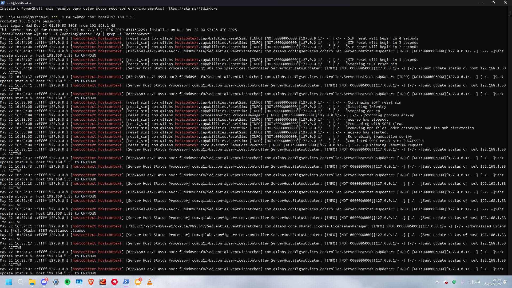  
*Figura 2: Resolução de problemas de MACs SSH e monitoramento inicial via CLI.*

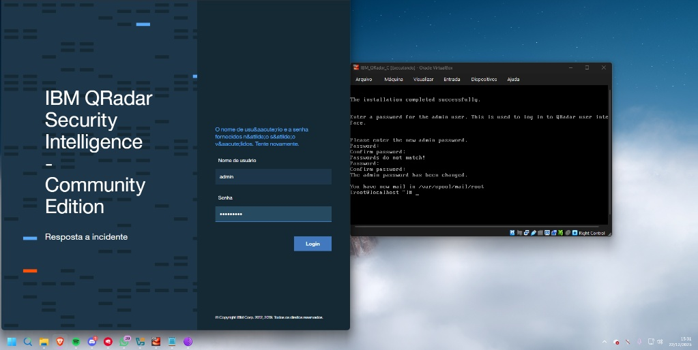  
*Figura 3: Primeiro acesso à interface administrativa após a configuração de credenciais.*

---

## 🔍 Etapa 2: Resolução de problemas de infraestrutura (Virtualização)
Antes da estabilização completa do SIEM, surgiram problemas na camada de virtualização que impediram a operação adequada da máquina virtual.

* **Erro MachineWrap:** Erro grave de interface (E_FAIL) no VirtualBox que impediu a anexação correta do disco VDI.
* **Solução:** Ajuste das controladoras SATA e IDE nas configurações de armazenamento da VM para restaurar a integridade do boot.

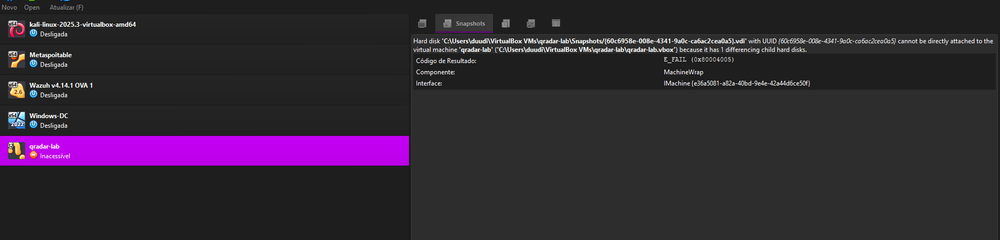  
*Figura 4: Diagnóstico de falha crítica na anexação do disco rígido virtual.*

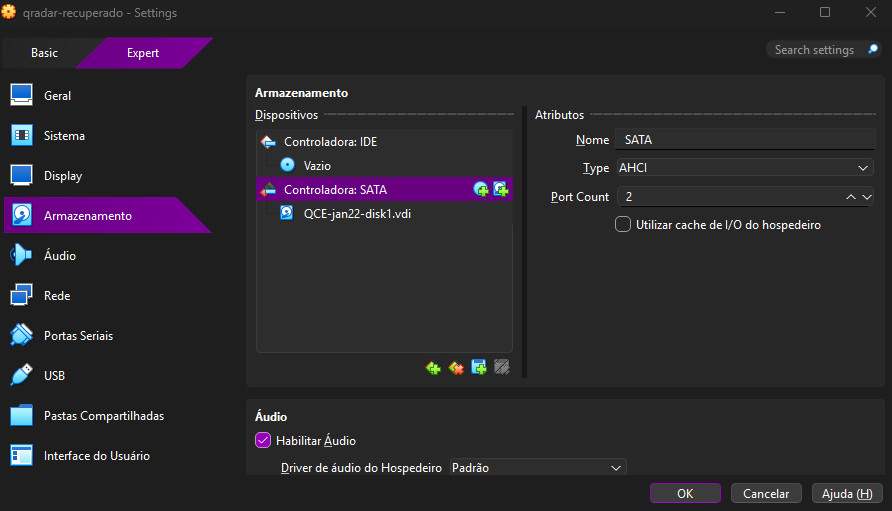  
*Figura 5: Reconfiguração das controladoras para recuperação da VM.*

---

## 🔍 Etapa 3: Diagnóstico de Serviços e Licença (Causa Raiz)

### 1. Restrição de licença ("Time Travel")
Apesar de o serviço de coleta `ecs-ec-ingress` estar em execução, a porta UDP/514 permanecia fechada. A análise dos registros indicou que a licença do QRadar encontrava-se expirada.

**Solução:** Foi realizado um procedimento de *"Time Travel"*, ajustando o relógio do sistema para **maio de 2020** e desativando o NTP, permitindo a validação temporária da licença para fins de estudo.

  
*Figura 6: Verificação do status do coletor de eventos e da porta 514.*

### 2. Monitoramento de performance
Com os serviços ativos, utilizei o comando `top` para monitorar a carga dos processos Java e avaliar a estabilização geral do sistema.

  
*Figura 7: Análise de consumo de hardware em tempo real.*

---

## 🚨 Etapa 4: Recuperação Crítica (Ariel e Banco de Dados)
Durante a validação da coleta, identifiquei um problema que impedia a visualização dos logs: falha de conexão com o servidor de consultas.

* **Diagnóstico:** Utilizando o `journalctl`, constatei que o serviço `ariel_query_server` não iniciava corretamente.
* **Intervenção manual:** Utilização do `psql` para acesso ao banco de dados e investigação de tabelas de sistema, além da análise de processos órfãos com `ps aux | grep ariel`, visando a restauração do serviço.

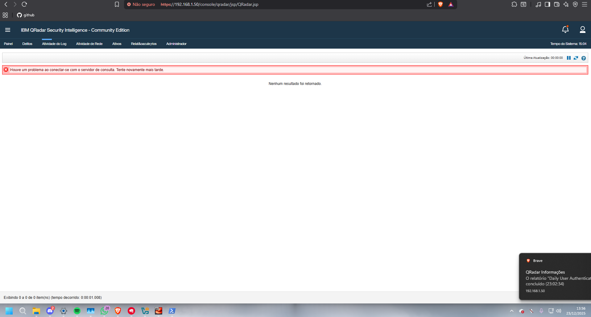  
*Figura 8: Interface do QRadar exibindo falha no servidor de busca Ariel.*

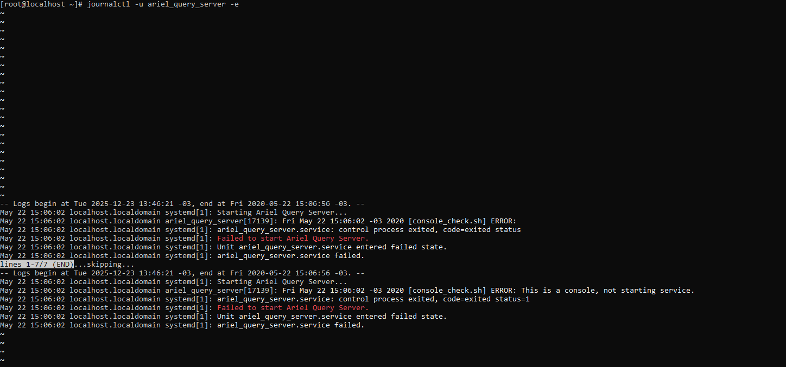  
*Figura 9: Análise de logs do sistema identificando a causa da falha do serviço.*

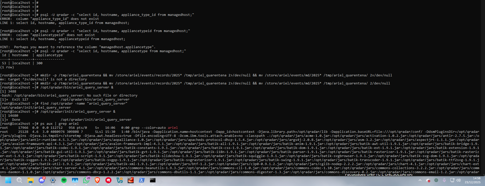  
*Figura 10: Troubleshooting avançado via terminal investigando a base de dados Ariel.*

---

## 📡 Etapa 5: Coleta e Engenharia de Logs (Editor DSM)

### Aquisição por meio do PowerShell
Foi desenvolvido um script em PowerShell para converter eventos locais em mensagens Syslog e enviá-las via UDP na porta 514. O tráfego foi validado utilizando `tcpdump` e monitoramento por SSH.

  
*Figura 11: Implementação do script para envio de telemetria customizada.*

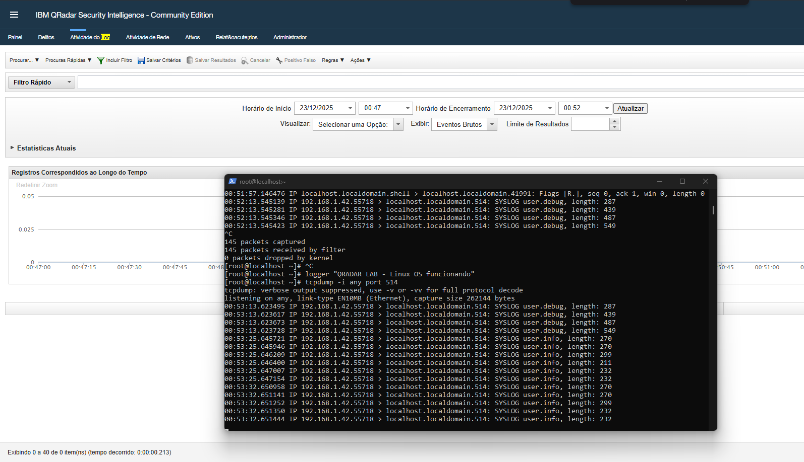  
*Figura 12: Confirmação visual do tráfego UDP/514 chegando ao SIEM.*

### Normalização e mapeamento de QID
Logs inicialmente classificados como **"Unknown"** foram padronizados. Utilizei o **DSM Editor** para criar o **QID 11750001**, possibilitando o reconhecimento e a correta classificação do evento `host_Script`.

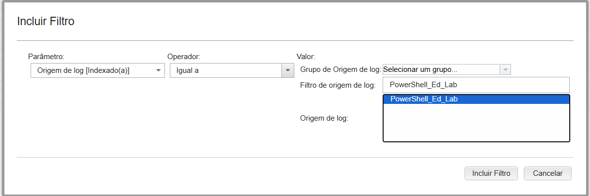  
*Figura 13: Aplicação de filtro para isolar a nova fonte de log.*

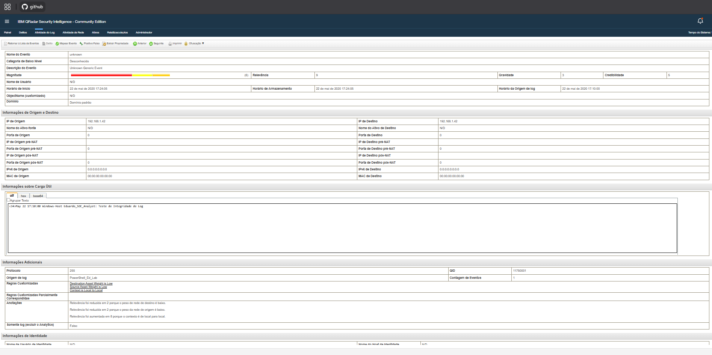  
*Figura 14: Engenharia de logs convertendo dados desconhecidos em eventos acionáveis.*

---

## ✅ Resultado Final e Painéis de Controle
Com a infraestrutura recuperada e os logs devidamente normalizados, os eventos passaram a ser apresentados corretamente e consolidados em painéis de monitoramento.

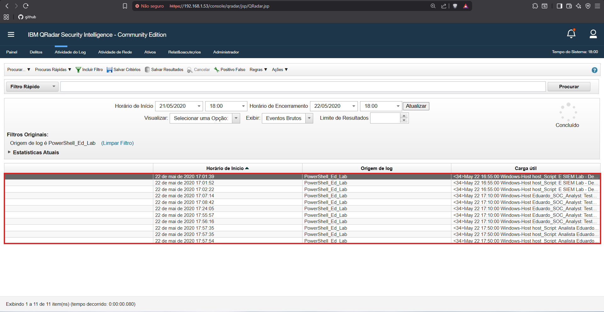  
*Figura 15: Visualização dos registros processados em tempo real na aba Log Activity.*

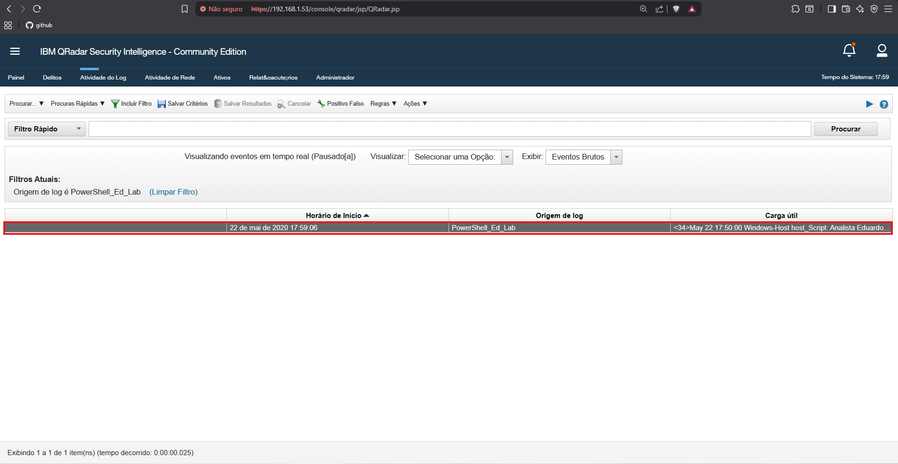  
*Figura 16: Confirmação da normalização do evento após o mapeamento de QID.*

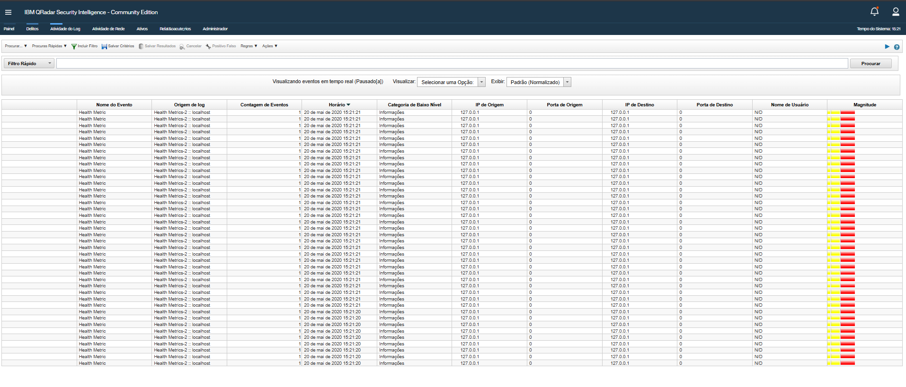  
*Figura 17: Aba Log Activity exibindo métricas de saúde e eventos processados com sucesso.*

---

📄 Este projeto possui um estudo de caso técnico detalhado em [CASE_TECNICO.md](CASE_TECNICO.md)

## 📚 Conclusão
Este laboratório demonstra que a atuação em um SOC vai além do simples monitoramento de painéis. O domínio de infraestrutura, banco de dados e rede é essencial para garantir visibilidade, confiabilidade operacional e resposta eficaz a incidentes.

---

*Projeto de estudo em Blue Team Operations.*
