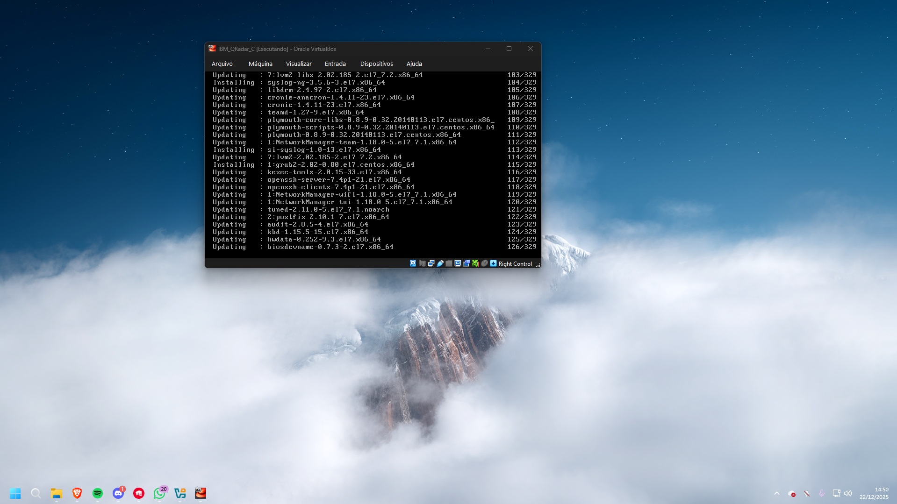
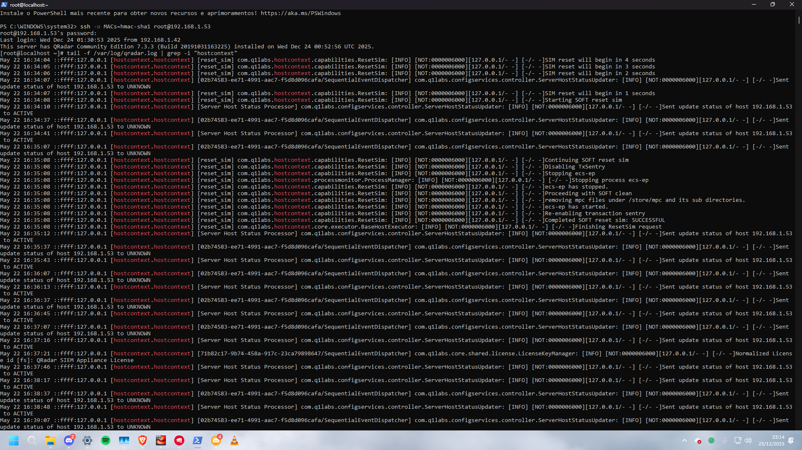
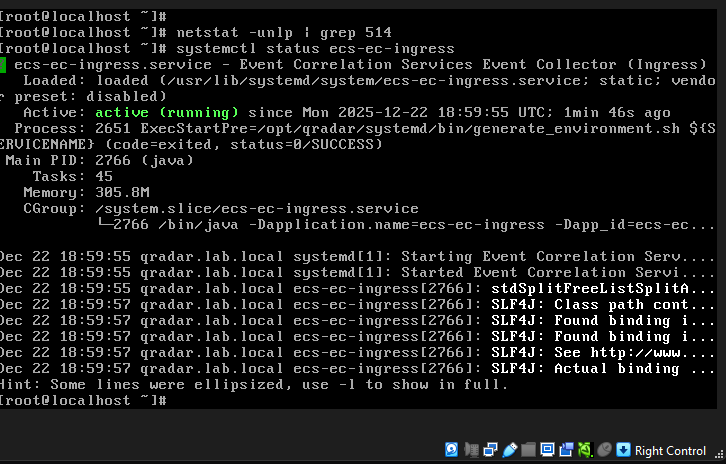
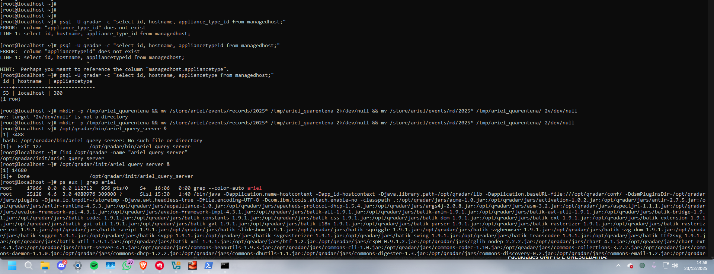
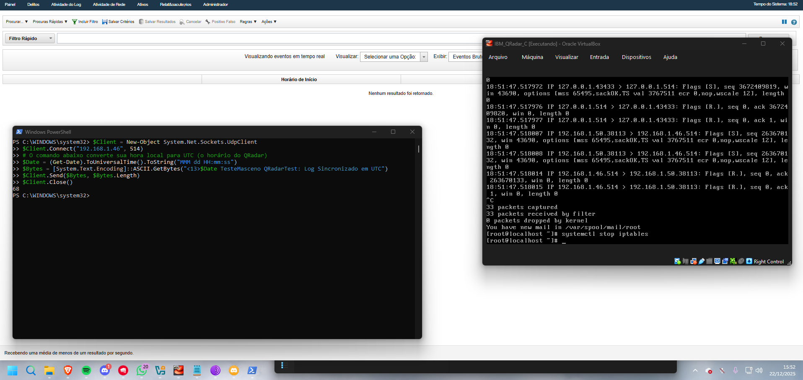
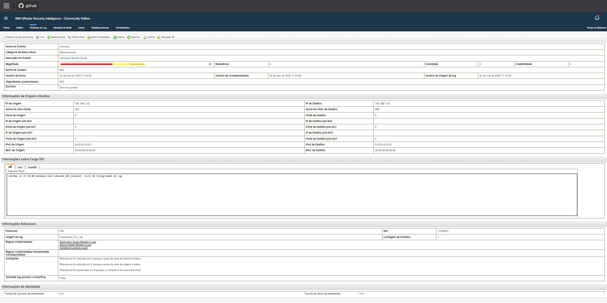
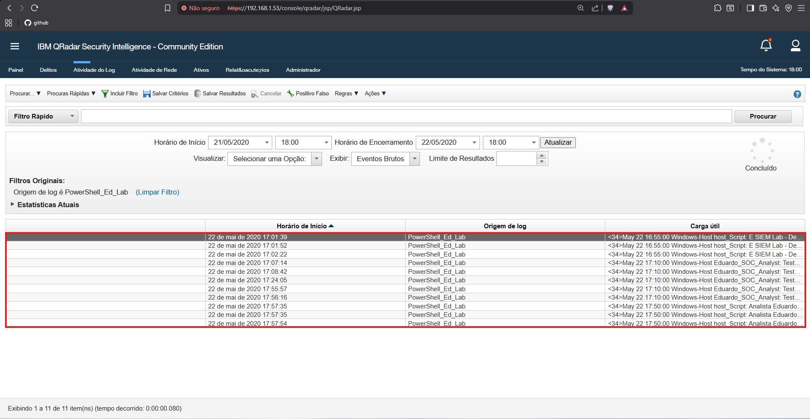

# QRadar SIEM: Deployment & Advanced Troubleshooting 🛡️

Este laboratório documenta o deploy do **IBM QRadar Community Edition** e a resolução de falhas críticas que impediam a operação do SIEM, desde erros de licenciamento até a recuperação de serviços de banco de dados.

## Stack Técnica
* **SIEM:** IBM QRadar CE v7.3.3 (CentOS 7)
* **Ambiente:** VirtualBox (Rede em modo Bridge)
* **Ingestão:** Windows 11 via PowerShell/Syslog (UDP 514)

---

## 🛠️ Troubleshooting de Implementação

### 1. Acesso e Virtualização
O primeiro entrave foi o acesso via SSH no Windows 11, que rejeitava a conexão por incompatibilidade de algoritmos (MACs). Forcei o uso do `hmac-sha1` no cliente para liberar o acesso administrativo. 

Na camada de hardware virtual, corrigi falhas de anexação de disco (Erro MachineWrap E_FAIL) ajustando as controladoras SATA/IDE para garantir a persistência do boot.

### 2. Recuperação de Licença e Coletor
Mesmo com o serviço `ecs-ec-ingress` rodando, o QRadar não abria a porta 514 para coleta. Identifiquei que a licença da versão Community estava expirada. 

**Solução:** Apliquei um "Time Travel" no CentOS (ajuste de data para maio de 2020) e desativei o NTP. Isso validou a licença e liberou o socket UDP/514 para recepção de logs.

### 3. Recuperação do Ariel Query Server (Banco de Dados)
Identifiquei via `journalctl` que o motor de buscas (`ariel_query_server`) estava em falha, impedindo a visualização dos logs na interface. Usei o `psql` para auditar as tabelas do sistema e limpei processos órfãos, restaurando a comunicação com a base de dados Ariel.

---

## 📡 Engenharia de Logs (DSM Editor)

Para validar o ambiente, criei um script em PowerShell para encaminhar eventos do Windows via Syslog. Como os logs chegavam como "Unknown", utilizei o **DSM Editor** para criar o **QID 11750001**, permitindo a normalização e categorização correta do evento `host_Script`.

## 🏁 Resultado Final
O ambiente foi estabilizado com sucesso. O dashboard agora reflete a saúde do sistema e o processamento de eventos em tempo real, provando que a visibilidade foi restabelecida.

---
*Foco em Blue Team Operations e Defesa de Infraestrutura.*
